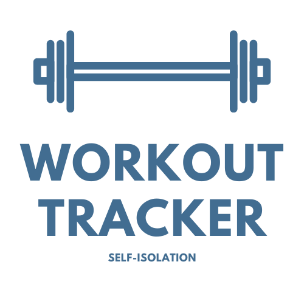
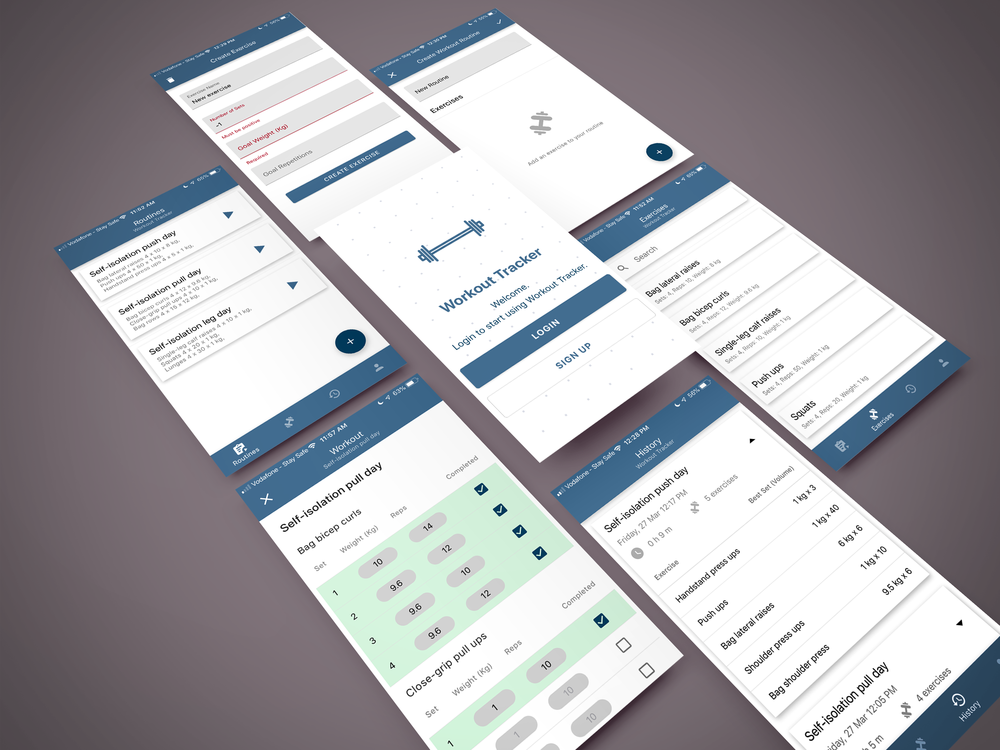
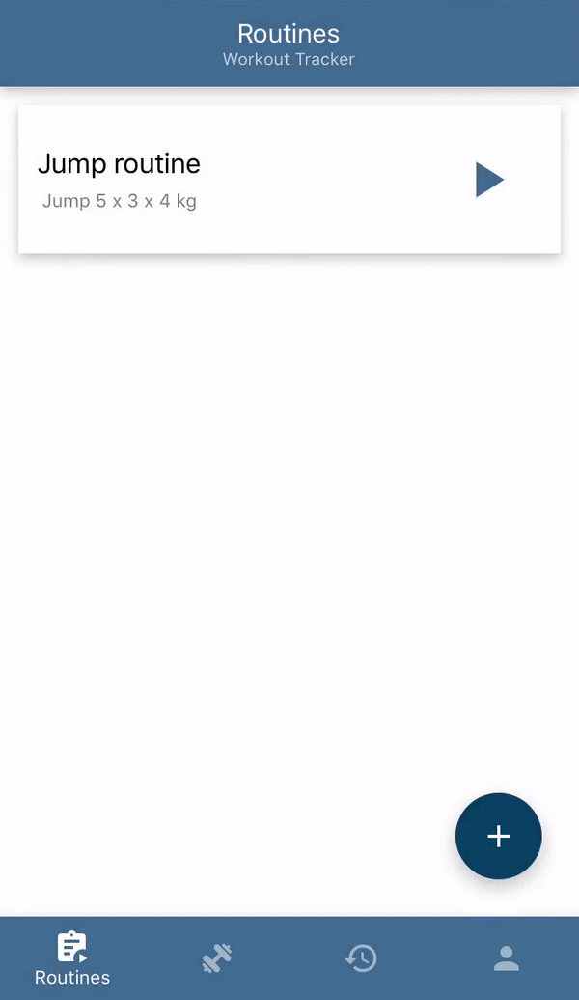
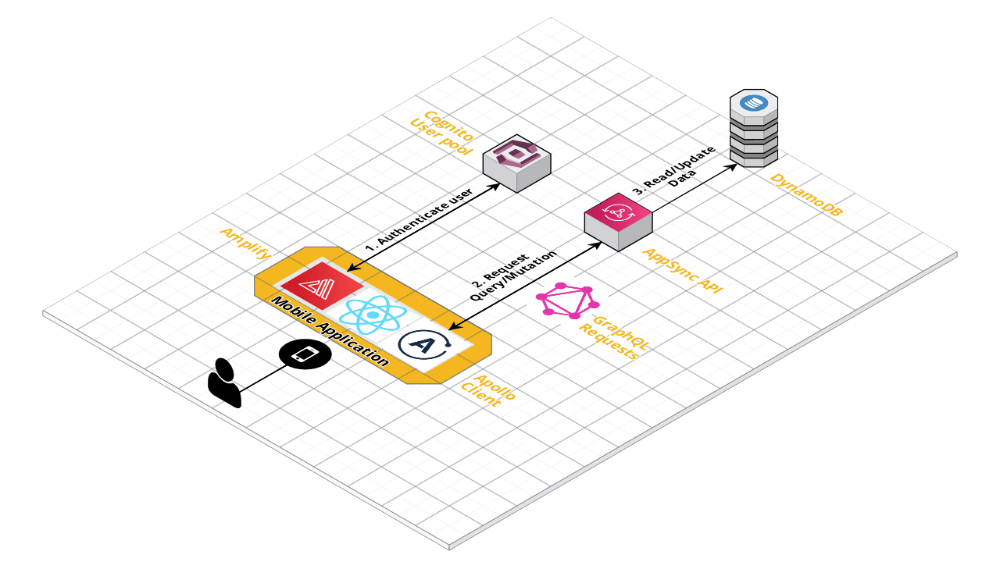

  

# Workout Tracker

An app to create workout routines and exercises to track your workout progress during isolation/quarantine.

## Motivation

I created this app to learn new technologies such as [GraphQL](https://graphql.org/), [Apollo](https://www.apollographql.com/), and [AWS Amplify](https://aws-amplify.github.io/). I also enjoy working out and wanted full control in analysing my workout data.

The application was also built with React hooks, React Native, TypeScript as I enjoy using these technologies.

## Usage

You can try out the app [here](https://expo.io/@harrisonleach1/workout-tracker) through Expo.

## Application Showcase

## Features

- Authentication through AWS Cognito
- Creation of exercises and routines (a collection of exercises)
- Use created routines to perform workouts
- View your past workout history
- View and search your created exercises

## Demo

#### Creating a routine

  

#### Performing a workout

  

## Application Architecture Overview

Diagram created with [Cloudcraft.co](https://cloudcraft.co/)

## Built with

- [Typescript](https://www.typescriptlang.org/)
- [React Native](https://reactnative.dev/) and React hooks
- [GraphQL](https://graphql.org/)
- [Apollo Client](https://www.apollographql.com/docs/react/)
- [AWS Amplify](https://aws-amplify.github.io/)
- [React Native Paper](https://github.com/callstack/react-native-paper)

## Future work

- Ability to edit and delete routines and exercises
- Add offline first capability. Currently, there is limited offline functionality
- Ability to add existing exercises to routines
- Add a collection of default exercises and routines
- Add workout history graphs, e.g. estimated 1RM progression for an exercise
- Fix performance issues once Amplify limitations have been addressed
- Fix bugs

## Acknowledgements

- Logo made with [Canva](https://www.canva.com/create/logos/)
