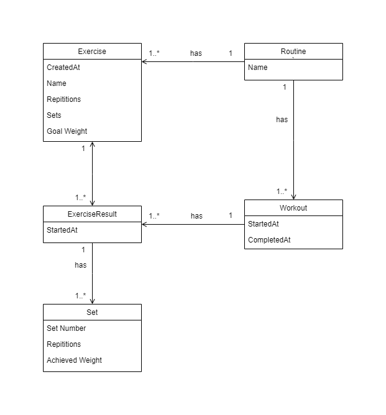

# Data Entities

## Diagram

## Design Decisions

1. `ExerciseResult` table - the alternative to using this is for each `Set` to have a reference to `Workout` and `Exercise`. Using intermediate table `ExerciseResult` results in:
   - Reduction of redundant repetitions of references to `Workout` and `Exercise.`
   - A trade-off with this approach is, expensive additional joins
