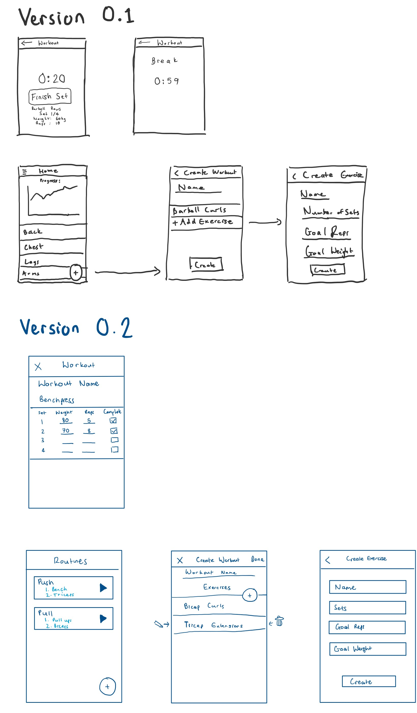

# Data Entities

## Diagram

## Design Decisions

1. `ExerciseResult` table - the alternative to using this is for each `Set` to have a reference to `Workout` and `Exercise`. Using intermediate table `ExerciseResult` results in:
   - Reduction of redundant repetitions of references to `Workout` and `Exercise.`
   - A trade-off with this approach is, expensive additional joins

# UI Mockups

## Diagrams

## Design Decisions

1. Material Design has been followed to provide a familiar and intuitive user experience.
1. From `v0.1` to `v0.2` the timer screens were removed, as they did not provide a very fast UX.
   Specifically, if you had already completed a workout, you could not quickly enter your stats, because you would
   have to click through all the timing screens.
1. Graphs were chosen not be implemented yet.
